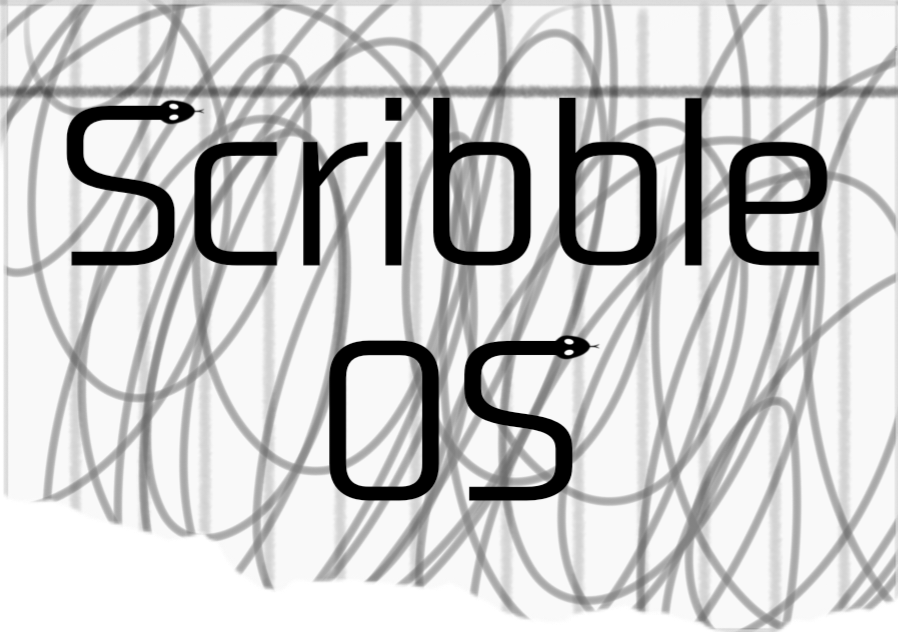
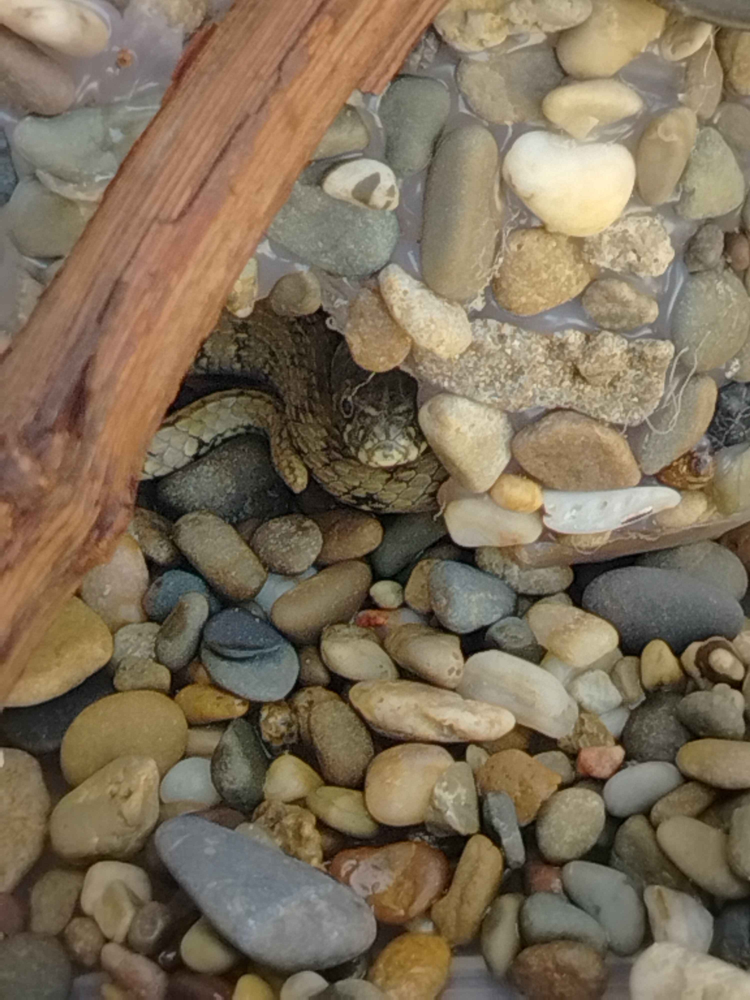

  
   
  <small>Thank you Mach10 for the logo!!! Creds to him</small>

<h1 align="center">💻 ScribbleOS 4.0 - Notebook Edition</h1>

<h3 align="center">

Total Development Commits: <!--COMMIT_COUNT-->928<!--/COMMIT_COUNT-->

</h3>

<strong>A custom-built, 64-bit "Notebook" style operating system.</strong> 

Featuring a hardened security, multi-terminal interface, and real-time hardware integration. 

made by <strong>علي يحي علي صميلي</strong>

---

> [! WARNING]
> Some things don't work when you're using real hardware, and there are a few that haven't been tested yet.

ScribbleOS 4 is a OS that was built from scratch. It's like a notebook for your computer, but it's safe and secure. This OS has a few cool features, like a multi-terminal interface, which is like having multiple windows open at the same time. It also has a status bar that's super accurate and can keep track of time really well. The person who made all this possible is **علي يحي علي صميلي** Which is me.

---

## Key Features

* **64-bit Long Mode:** This is a way to start up a computer from a 32-bit Multiboot 2 system and get into a 64-bit environment.
* **Stronger Protection:** A security feature, called `lock_system_hardened`, has been added to keep users safe. It remembers when someone (a stealer) tries to log in with the wrong password, even after you turn your computer off and on again. This helps stop people from brute forcing your password.
* **Multi-TTY Support:** Supports 10 virtual terminals (`TTY0`–`TTY9`) accessible via `Ctrl + Alt + F1-F10`.
* **Status Bar at a Glance:** You'll always see the current date and time in a 12-hour format, and the ID of the active TTY, all displayed in a dedicated space at the bottom of your screen, and it gets its information straight from the CMOS.
* **Dynamic Shell:** Has command tab-completion, system diagnostics (`sysinfo`), and real-time memory tracking.

---

## 🏗️ Technical Architecture

### 1. Boot & Memory
* **Kernel Entry:** Written in ASM (`boot.asm`), it builds a 4-level paging hierarchy (`PML4` -> `PDPT` -> `PDT`).
* **Huge Pages:** To make things easier, the system uses big chunks of memory, called "Huge Pages", to ID map out the first 64MB of RAM. This is done in a simple way, using 2MB pages, which helps to keep the initial memory map straightforward.
* **Heap Manager:** A dynamic memory allocator starting right after the kernel (`kernel_end`) to prevent memory allocations from overwriting kernel code.

### 2. Clock & Timing

* **PIT Frequency:** The Programmable Interval Timer is set to run at a frequency of **200Hz**, which is done by using a divisor of 11931. This setting is used for both uptime and sleep functions, note that it operates at **200Hz** instead of the expected **100Hz**.
* **Polling Loop:** The kernel has a loop that checks the hardware regularly, called `timer_wait_tick`, to make sure the clock updates every 100 ticks without stopping what the user is doing.

### 3. Video & I/O

* **VGA Driver:** Manages an 80x25 text buffer at `0xB8000` with custom "Notebook Yellow" styling (`0x1E`, hence why ScribbleOS is named).
* **CMOS Integration:** It talks directly to the computer's hardware ports, like `0x70/0x71` (CMOS ports), to get the current time and keep track of any security issues that happen. This helps the system stay safe and know what's going on at all times.

---

## 🛠️ Built-in Shell Commands

| Command | Description |
| :--- | :--- |
| `help` | Lists all system commands. |
| `cls` | Clears the screen. |
| `sysinfo` | Displays CPU vendor, RAM usage. |
| `uptime` | Displays the amount of time ScribbleOS has been up and running. |
| `free` | This tool checks how much RAM is being used, including the total amount, how much is used, and how much is free. |
| `timezone` | This setting changes the clock in the status bar to show the right time for your area, and it does it instantly. |
| `lock` | This is what you use to manually trigger a super secure lock screen. |
| `test` | Checks the timer is working correctly by counting down from 5 seconds. |
| `beep` | Makes a sound on your computer, like a warning bell, using the PC Speaker, but it has a problem that needs to be fixed, which you can find out more about in the Bugs section. |
| `twins` | This is where I list my twins' names, they're really special to me, my favorite twins 🥹🥹🥹 |
| `sleep` | This command makes the system sleep until you press a key. |
| `plane` | It displays an image of a plane using ASCII characters. |
| `about_dev` | About the developer. |
| `echo` | prints out the text you want to see on the screen. |
| `ayah` | It picks a random verse from the Quran and shows it to you.
| `verse` | It picks a random verse from the Bible and displays it for you. |
| `tdadd` | This is used to add a new to-do item to the list in memory. |
| `tdshw` | Displays tasks stored in memory. |
| `calc` | Simple calculator. |

*Run `help` in the shell to see even more commands!* 🥹🥹🥹

---

## 🍎 Bad Apple!! VGA Demo

ScribbleOS 4 comes with a special demo that shows off its capabilities. This demo is called "Bad Apple!!" and it's an ASCII animation. The main goal of this demo is to highlight how stable the kernel is when it comes to quickly mapping VGA memory. It also showcases the **Notebook Edition** and its independent TTY system, which can handle things on its own.

## 🛠 Technical Specifications

* **Resolution:** 80x24 *(Workspace mode — row 25 is reserved for the status bar!)*
* The frame rate is around 10 to 15 frames per second, and you can actually adjust this by changing the kernel delay loop.
* **Protected Status Bar:** The 25th row still works perfectly, showing the current time and active TTY ID in real-time, without any interruptions or flickering, even when something is playing.
* **Memory Mapping:** Direct writes to `0xB8000` using a high-performance DMA-simulated loop.

## NEW MASCOT!

    
     
    <small>It is DEXVs snake, go check out his keyboard! https://github.com/ANTI-XV/XVoard</small>

---

## 💬 ScribbleOS Community

* [Discord Server](https://discord.gg/26JRFCRpFV)

---

## 🐛 Bugs

* Beep stutters in QEMU emulator.
* For some reason, When PIT speed is set to 100Hz, the computer makes a second half a second, but 200Hz doesnt

---

## 📋 Todo

- [x] **ADD:** ATA Support (With AliFS)
- [x] **Fix:** Beep stutter issue *(works fine on actual hardware)*
- [ ] **ADD:** PCI Driver *(WIP)*
- [ ] **Add:** Support for Ethernet and/or Wi-Fi connections, this feature is currently a work in progress.
- [ ] **GUI:** Create a user interface for the OS, but this might not happen anytime soon as i already made a TUI.

---

## 📜 Licensing & Credits

### Kernel & Operating System

ScribbleOS 4.0 is free to use because it's open-source, and it's covered by the **MIT License**.

By using, modifying, or distributing this software, you agree to the following terms:
* When using this software, you have to keep the original copyright notice and permission notice in all files.
* **No Guarantee:** This OS comes with no promises. Im not responsible if something goes wrong or you lose data when you use it.

> [! CAUTION]
> **Important Notice:** If you change or share this, remember to give credit. The MIT license lets you modify and share, but you can't remove my name or say you made it if you didn't. You also can't rebrand ScribbleOS without saying who really made it. If you don't follow these rules, it's against the law and we'll know because of Git history, We'll tell everyone about it on places like GitHub, And if Github doesn't bring it down or anything, May Allah put u in front of me in the day of judgement so we can have a proper conversation.

### Demo Assets

* **Bad Apple!! Animation: ** This is based on the *Touhou Project*. We're using these assets to show how well the ScribbleOS 4 video driver works, and they were made using ffmpeg on the bad apple video.
